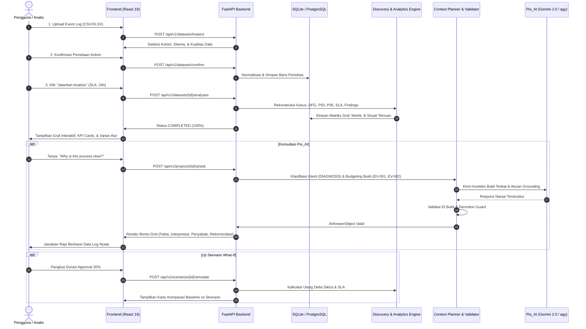
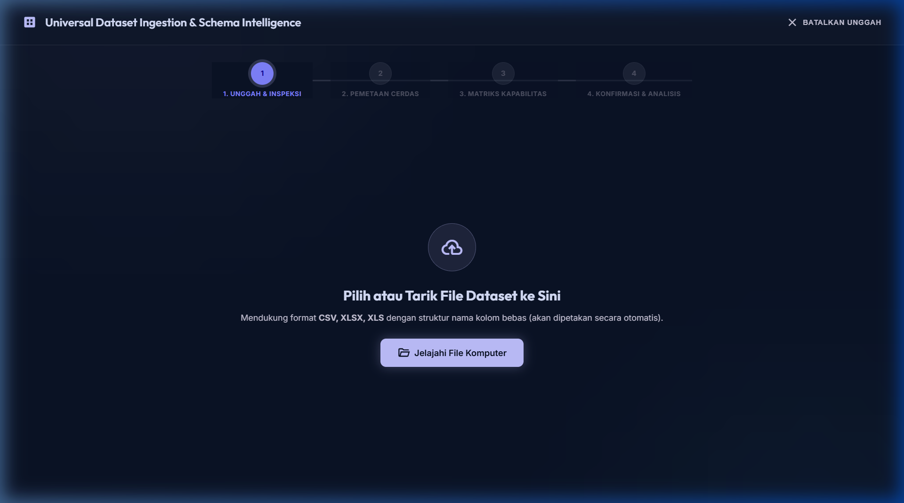
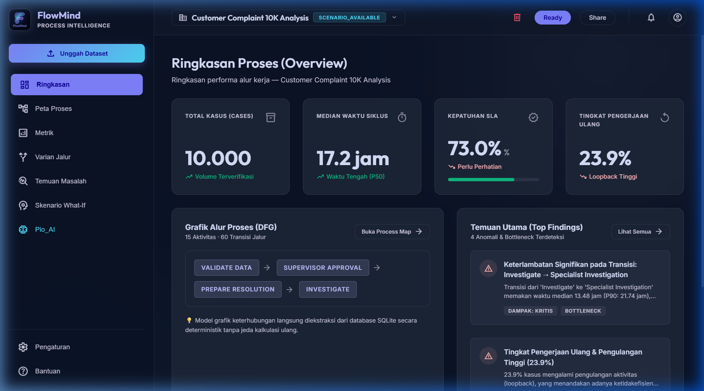
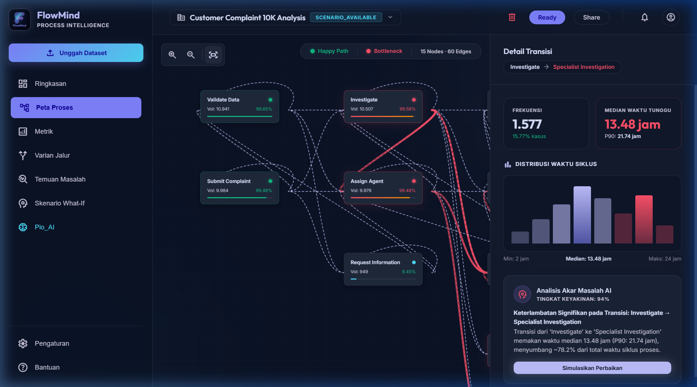
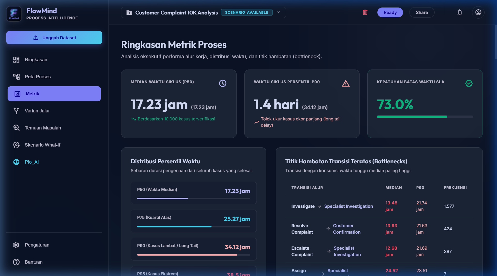
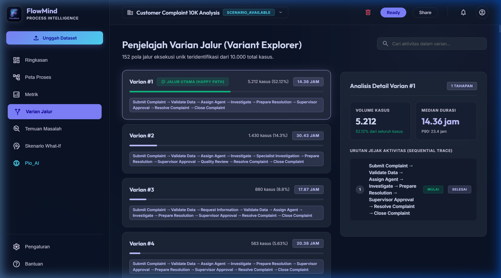
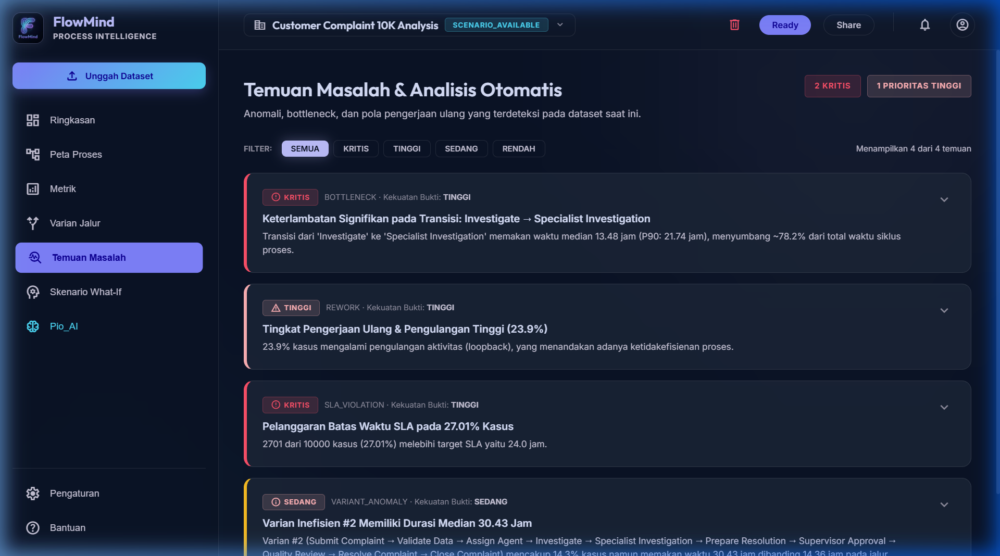
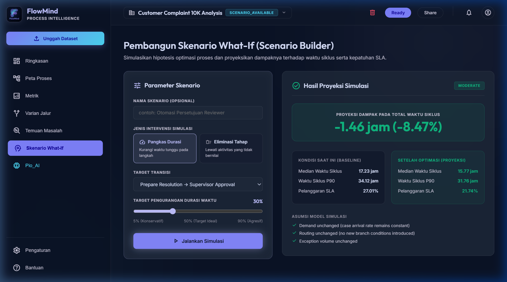
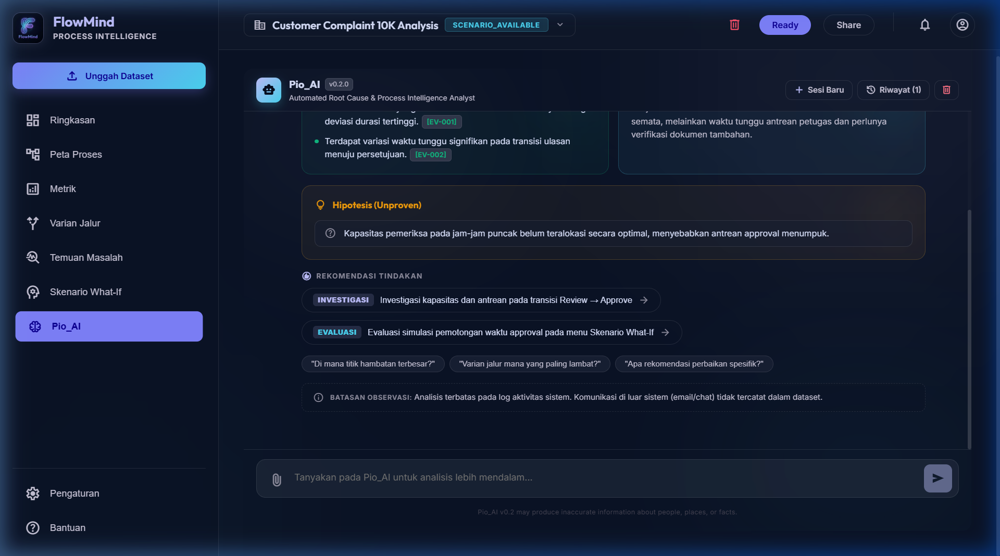

<div align="center">

# ⚡ FloMind_Elite (Pio_AI)
### *Enterprise Process Mining & Evidence-Grounded Hybrid Intelligence System*

[](https://python.org)
[](https://fastapi.tiangolo.com)
[](https://react.dev)
[](https://vitejs.dev)
[](https://ai.google.dev)
[](#2-arsitektur-hybrid-intelligence-dual-core-engine)
[](#7-pengujian-otomatis-test-suites)

<p align="center">
  Platform <b>Enterprise Process Mining & Evidence-Grounded Hybrid Intelligence</b> generasi baru yang merekonstruksi event logs menjadi graf alur proses interaktif (DFG), mendeteksi anomali & bottleneck (P50/P90), menjalankan simulasi digital twin <i>What-If</i> matematis, dan menyediakan asisten konsultan diagnostik <b>Pio_AI</b> (Google Gemini) yang 100% berpijak pada bukti empiris tanpa risiko halusinasi.
</p>

---

</div>

## 📌 Daftar Isi
- [1. Latar Belakang & Masalah yang Dipecahkan](#1-latar-belakang--masalah-yang-dipecahkan)
- [2. Arsitektur Hybrid Intelligence (Dual-Core Engine)](#2-arsitektur-hybrid-intelligence-dual-core-engine)
  - [Keunggulan Pendekatan Hybrid Intelligence](#-keunggulan-pendekatan-hybrid-intelligence)
- [3. Deep-Dive Pilar Mesin & Algoritma](#3-deep-dive-pilar-mesin--algoritma)
  - [Pilar 1: Universal Ingestion, Classifier & Memory Profile](#pilar-1-universal-ingestion-classifier--memory-profile)
  - [Pilar 2: Graph Discovery Engine (Directly-Follows Graph / DFG)](#pilar-2-graph-discovery-engine-directly-follows-graph--dfg)
  - [Pilar 3: Statistical Analytics & Deterministic Signal Engine](#pilar-3-statistical-analytics--deterministic-signal-engine)
  - [Pilar 4: What-If Scenario Simulation Engine](#pilar-4-what-if-scenario-simulation-engine)
  - [Pilar 5: Pio_AI — Grounded Generative AI Engine](#pilar-5-pio_ai--grounded-generative-ai-engine)
- [4. Diagram Alur Kerja Sistem (End-to-End Workflow)](#4-diagram-alur-kerja-sistem-end-to-end-workflow)
- [5. Struktur Direktori Proyek](#5-struktur-direktori-proyek)
- [6. Panduan Instalasi & Menjalankan](#6-panduan-instalasi--menjalankan)
- [7. Pengujian Otomatis (Test Suites)](#7-pengujian-otomatis-test-suites)
- [8. Spesifikasi Kontrak API (REST Endpoints)](#8-spesifikasi-kontrak-api-rest-endpoints)
- [9. Desain & Antarmuka Pengguna (UI/UX)](#9-desain--antarmuka-pengguna-uiux)
- [10. Lisensi](#10-lisensi)

---

## 1. Latar Belakang & Masalah yang Dipecahkan

Dalam operasional bisnis modern (perbankan, e-commerce, logistik, layanan pelanggan, manufaktur), jutaan transaksi dieksekusi setiap hari. Namun, sebagian besar organisasi mengalami masalah **"Blindspot Operasional"**:
1. **Ketidaktahuan Jalur Riil**: Alur proses nyata di lapangan sering kali berbeda drastis dari SOP di atas kertas karena adanya percabangan tak terduga, jalan pintas (*shortcuts*), dan revisi bolak-balik (*rework loops*).
2. **Keterlambatan SLA & Bottleneck Tersembunyi**: Mengapa sebuah tiket komplain membutuhkan 10 jam padahal proses aktifnya hanya 30 menit? Di mana antrean pasif menumpuk?
3. **Analisis Terfragmentasi**: Tim operasional terjebak antara melihat grafik dashboard BI yang pasif tanpa narasi, atau membaca laporan konsultan yang memakan waktu berminggu-minggu.

**FloMind_Elite** hadir sebagai platform **Process Intelligence generasi baru** yang merekonstruksi data jejak digital (*Event Logs*) menjadi graf alur proses dinamis, menganalisis hambatan secara matematis, menguji simulasi perbaikan, dan menyediakan asisten konsultan AI cerdas yang **100% berpijak pada bukti empiris**.

---

## 2. Arsitektur Hybrid Intelligence (Dual-Core Engine)

**FloMind_Elite** dirancang dengan arsitektur **Hybrid Intelligence (Dual-Core Engine)** yang membagi tugas analitik secara terpisah namun harmonis antara **Kalkulasi Deterministik Matematis** dan **Penalaran Kualitatif Generative AI**.

```
┌────────────────────────────────────────────────────────────────────────┐
│               CORE 1: DETERMINISTIC CALCULATION ENGINE                 │
│  (Python 3.10 • Polars/Pandas • NetworkX/Graph Algorithms • NumPy)     │
│                                                                        │
│  • Time-Series Event Ordering & Case Tracing                          │
│  • Directly-Follows Graph (DFG) Adjacency & Variant Aggregation       │
│  • Non-Parametric Statistics: Exact P50, P75, P90, P95, Mean, Min/Max │
│  • Weighted Bottleneck Score & SLA Compliance Engine                  │
│  • Deterministic Finding Signal Generator & What-If Simulation        │
│  ➡️ KEUNGGULAN: 100% Akurat, Terverifikasi, Objektif, & Anti-Halusinasi│
└───────────────────────────────────┬────────────────────────────────────┘
                                    │ Menyediakan Paket Bukti Terikat (EV-001..EV-050)
                                    ▼
┌────────────────────────────────────────────────────────────────────────┐
│            MIDDLEWARE: CONTEXT PLANNER & RESPONSE VALIDATOR            │
│                                                                        │
│  • Intent Routing (Membedakan Analisis Diagnostik vs Chat Santai)      │
│  • Strict Context Budgeting (Menyaring metrik paling relevan)          │
│  • Evidence Binding Protocol (Mengunci klaim ke ID Bukti EV-xxx)       │
│  • Demotion Guard (Demosi otomatis klaim tanpa data menjadi Hipotesis) │
│  • Causal Language Sanitizer (Mengubah klaim absolut -> asosiatif)     │
└───────────────────────────────────┬────────────────────────────────────┘
                                    │ Konteks Terstruktur & Bounded
                                    ▼
┌────────────────────────────────────────────────────────────────────────┐
│                 CORE 2: COGNITIVE GENERATIVE AI ENGINE                 │
│             (Google Gemini 2.0 Flash via REST API & agy CLI)           │
│                                                                        │
│  • Pemahaman Konteks Bisnis & Dekonstruksi Akar Masalah (Root Cause)   │
│  • Perumusan Hipotesis Operasional di Balik Anomali Data               │
│  • Rekomendasi Tindakan Aksi Nyata (INVESTIGASI, EVALUASI, STANDARISASI│
│  • Konsultasi Percakapan Interaktif Alami (Bahasa Indonesia & Global)  │
└────────────────────────────────────────────────────────────────────────┘
```

### 🚀 Keunggulan Pendekatan Hybrid Intelligence

Pendekatan **Hybrid Dual-Core** pada FloMind_Elite memberikan keunggulan langsung bagi tim operasional:

1. **100% Anti-Halusinasi (Grounded AI)**: Seluruh metrik durasi, persentil siklus (P50/P90), dan frekuensi dihitung secara matematis oleh engine Python backend—bukan ditebak oleh LLM.
2. **Efisiensi Token & Respon Instan**: Sistem tidak membuang token untuk mengirim seluruh baris log mentah, melainkan hanya paket bukti terikat (*Evidence Bundle*) yang relevan dengan pertanyaan.
3. **Wawasan Operasional Praktis**: Menghubungkan titik-titik data pasif menjadi narasi bisnis yang dapat ditindaklanjuti (*Actionable Recommendations*).
4. **Validasi & Demotion Guard**: Setiap klaim tanpa dukungan bukti data langsung secara otomatis ditandai sebagai hipotesis terbuka, menjaga integritas keputusan manajemen.

---

## 3. Deep-Dive Pilar Mesin & Algoritma

### Pilar 1: Universal Ingestion, Classifier & Memory Profile
* **Automatic Dataset Type Classifier**: Menggunakan analisis frekuensi kardinalitas ID dan sebaran timestamp untuk membedakan apakah file yang diunggah adalah:
  - `EVENT_LOG` (Format baris per peristiwa berurutan waktu — **Diterima untuk Analisis**)
  - `TRANSACTION_TABLE` (Format 1 baris per transaksi/order — **Ditolak secara elegan dengan panduan konversi ke event log**)
* **Fuzzy Multi-Language Column Matcher**: Heuristik pencocokan semantik otomatis untuk mengenali kolom wajib:
  - `case_id`: `ticket_id`, `order_id`, `nomor_kasus`, `complaint_id`, `id_transaksi`
  - `activity`: `status`, `tahapan`, `event_name`, `activity_name`, `state`
  - `timestamp`: `created_at`, `waktu`, `event_time`, `datetime`, `tanggal_proses`
  - `actor`: `assigned_to`, `petugas`, `user`, `operator`, `pic`
  - `department`: `dept`, `divisi`, `team`, `unit_kerja`
* **Persistent Mapping Memory Profile**: Pola pemetaan disimpan dalam database (`MappingProfile`), sehingga file ekspor berkala dengan nama kolom yang sama akan terpetakan 100% secara instan.
* **Evaluator Kapabilitas Analitik**:
  - `FULL_CAPABILITY`: Seluruh kolom tersedia (Analisis Alur, Durasi, SLA, Aktor, Departemen).
  - `PARTIAL_NO_ACTOR` / `PARTIAL_NO_DEPT`: Kolom opsional absen (Analisis tetap berjalan pada metrik waktu & alur tanpa merusak sistem).
  - `DEGRADED_POINT_ONLY`: Timestamp hanya memiliki satu status (Diberikan peringatan keterbatasan durasi transisi).

---

### Pilar 2: Graph Discovery Engine (Directly-Follows Graph / DFG)
* **Algoritma Rekonstruksi Kasus (*Case Sequence Ordering*)**:
  Mengelompokkan event log berdasarkan `case_id`, menyortir berdasarkan `timestamp` secara presisi ($O(N \log N)$), dan mengekstrak pasangan transisi status berurutan:
  $$\text{Transition} = (A_i \rightarrow A_{i+1}, \Delta t = t_{i+1} - t_i)$$
* **Matriks Adjasensi DFG**:
  Menghitung frekuensi kemunculan setiap pasangan status di seluruh kasus:
  $$\text{Frequency}(u, v) = \sum_{c \in \text{Cases}} \mathbb{I}((u \rightarrow v) \in c)$$
* **Deteksi Simpul Awal, Akhir & Loop (*Start/End & Rework Detection*)**:
  - Simpul awal: Aktivitas pertama pada setiap kasus ($A_0$).
  - Simpul akhir: Aktivitas terakhir pada setiap kasus ($A_{\text{end}}$).
  - *Rework Loop*: Kemunculan kembali aktivitas yang sama dalam satu kasus ($\exists i < j : A_i = A_j$).
* **Variant Aggregation & Ranking**:
  Mengelompokkan kasus yang memiliki urutan alur identik:
  $$\text{Variant}_k = \langle A_1, A_2, \dots, A_m \rangle$$
  Menghitung persentase pangsa pasar volume (*share %*) dan durasi median per varian untuk membedakan jalur ideal (*happy path*) dengan jalur anomali.

---

### Pilar 3: Statistical Analytics & Deterministic Signal Engine
* **Statistik Non-Parametrik (Waktu Siklus Eksak)**:
  Waktu siklus proses bisnis di dunia nyata hampir selalu berdistribusi miring (*skewed distribution*). Oleh karena itu, FloMind_Elite menghindari rata-rata sederhana (*mean*) yang bias, dan menghitung persentil non-parametrik eksak:
  - **P50 (Median)**: Titik tengah durasi tipikal operasional normal.
  - **P75 & P90**: Representasi kasus lambat (*long-tail delay*).
  - **P95**: Kasus outlier/ekstrem.
* **Formula Weighted Bottleneck Scoring**:
  Menghitung bobot keparahan hambatan pada setiap transisi berdasarkan kombinasi durasi median dan volume transaksi:
  $$\text{Bottleneck Score}(u \rightarrow v) = \text{MedianDuration}(u \rightarrow v) \times \log(1 + \text{Frequency}(u \rightarrow v))$$
* **SLA Breach Engine**:
  Menghitung rasio pelanggaran terhadap target batas waktu SLA ($T_{\text{SLA}}$):
  $$\text{SLA Compliance \%} = \frac{|\{c \in \text{Cases} \mid \text{CycleTime}(c) \le T_{\text{SLA}}\}|}{|\text{Cases}|} \times 100\%$$
* **Rule-Based Deterministic Finding Generator**:
  Mendeteksi anomali tanpa LLM dengan 4 aturan sinyal:
  1. *Bottleneck Detection Rule* (Transisi dengan durasi $> 20\%$ total siklus).
  2. *SLA Violation Rule* (Tingkat kepatuhan SLA $< 90\%$).
  3. *High Rework Loop Rule* (Tingkat revisi bolak-balik $> 10\%$).
  4. *Variant Inefficiency Rule* (Disparitas varian lambat $> 1.5\times$ varian utama).

---

### Pilar 4: What-If Scenario Simulation Engine
Memungkinkan pengambil keputusan menguji intervensi proses sebelum diterapkan di lapangan:
* **Model Pengurangan Durasi (*Duration Reduction Simulation*)**:
  Mengurangi durasi transisi target sebesar parameter $P\%$ (misal: akselerasi *Review → Approve* sebesar $30\%$):
  $$\Delta t'_{\text{target}} = \Delta t_{\text{target}} \times \left(1 - \frac{P}{100}\right)$$
  $$\text{CycleTime}'(c) = \text{CycleTime}(c) - \sum_{e \in c \cap \text{target}} \Delta t_e \times \frac{P}{100}$$
* **Model Penghapusan Aktivitas (*Activity Elimination Simulation*)**:
  Mengeliminasi tahapan non-value-added dan menghubungkan langsung simpul pendahulu ke simpul penerus.
* **Kalkulasi Delta Output**:
  - Penurunan Median Waktu Siklus ($\Delta \text{Cycle Time Hours}$ dan $\%$)
  - Penurunan Rasio Pelanggaran SLA ($\Delta \text{SLA Violation \%}$)
  - Pelacak Asumsi (*Demand unchanged, Routing unchanged, Exception unchanged*).

---

### Pilar 5: Pio_AI — Grounded Generative AI Engine
* **Intent Classifier Multi-Domain**:
  - `CONVERSATION`: Merespons sapaan/obrolan santai tanpa membuang data metrik proses palsu.
  - `DIAGNOSIS`: Menjawab pertanyaan *"Mengapa proses lambat?"*, mendeteksi akar masalah.
  - `FACT_LOOKUP`: Menjawab pertanyaan spesifik *"Berapa median waktu siklus?"*, *"Berapa kepatuhan SLA?"*.
  - `PROCESS_ANALYSIS`: Menjelaskan alur operasional proses secara menyeluruh.
  - `VARIANT_ANALYSIS`: Membandingkan jalur alur tercepat vs paling lambat.
  - `RECOMMENDATION`: Memberikan 3 prioritas perbaikan (*INVESTIGASI, EVALUASI, STANDARISASI*).
  - `SCENARIO`: Menganalisis implikasi bisnis dari hasil simulasi skenario What-If.
* **Context Budgeting Protocol**:
  Membatasi paket bukti maksimal 2–4 metrik kunci teratas dan 1 transisi bottleneck utama agar konteks prompt tetap tajam dan bebas noise.
* **Demotion Guard & Sanitasi Bahasa Kausal**:
  - Klaim tanpa ID bukti langsung otomatis diberi prefix `[Hipotesis]`.
  - Kata kausal absolut (*"pasti menyebabkan"*, *"menjamin penurunan"*) otomatis diubah menjadi bahasa konservatif (*"berkorelasi kuat dengan"*, *"berpotensi menurunkan"*).
* **Dual-Mode Connectivity**:
  - Mode 1: **Google Gemini 2.0 Flash REST API** (Instan jika ada `GEMINI_API_KEY`).
  - Mode 2: **Google Antigravity CLI Adapter (`agy.EXE`)** (Menggunakan otentikasi sesi agy lokal otomatis).
  - Mode 3: **Deterministic Fallback Engine** (Penalaran cerdas offline jika koneksi internet terputus).

---

## 4. Diagram Alur Kerja Sistem (End-to-End Workflow)



---

## 5. Struktur Direktori Proyek

```
FloMind_Elite/
├── backend/
│   ├── config.py                      # Konfigurasi aplikasi & environment
│   ├── database.py                    # SQLAlchemy database engine & session maker
│   ├── models.py                      # Skema ORM: Project, Dataset, Event, Analysis, Finding, Scenario, MappingProfile
│   ├── schemas.py                     # Pydantic v2 DTO Request & Response Contracts
│   ├── main.py                        # Entrypoint FastAPI & konfigurasi CORS
│   ├── services/
│   │   ├── discovery_engine.py        # Algoritma rekonstruksi DFG, varian, dan loop
│   │   ├── analytics_engine.py        # Kalkulasi durasi siklus, persentil, SLA, & rework
│   │   ├── findings_engine.py         # Detektor sinyal temuan deterministik
│   │   ├── scenario_engine.py         # Mesin simulasi What-If reduction & elimination
│   │   ├── ai_analyst_engine.py       # Orchestrator Pio_AI & penalaran cerdas
│   │   ├── ingestion/
│   │   │   ├── classifier.py          # Event Log vs Transaction Table classifier
│   │   │   ├── capabilities.py        # Evaluator kapabilitas analitik dinamis
│   │   │   ├── profiles.py            # Toko profil memori pemetaan skema
│   │   │   └── pipeline.py            # Universal Ingestion pipeline
│   │   └── ai/
│   │       ├── contracts.py           # Kontrak Pydantic AI (EvidenceItem, AIAnswerObject)
│   │       ├── intent_router.py       # Intent router 7 domain + percakapan santai
│   │       ├── context_planner.py     # Budgeting konteks & generator ID EV-xxx
│   │       ├── validator.py           # Sanitasi klaim kausalitas & demosi hipotesis
│   │       └── provider.py            # Adapter Gemini REST API & Antigravity agy CLI
│   └── api/
│       ├── projects.py                # CRUD Proyek, Temuan, & endpoint AI ask
│       ├── datasets.py                # Upload, inspect, mapping, preview, & konfirmasi dataset
│       ├── analyses.py                # Eksekusi analisis, DFG graph, metrik, varian, temuan
│       ├── findings.py                # API Temuan deterministik
│       └── scenarios.py               # API Pembuatan skenario, validasi, & eksekusi simulasi
├── frontend/
│   ├── src/
│   │   ├── api/client.js              # Axios API client wrapper
│   │   ├── components/
│   │   │   ├── Header.jsx             # Topbar navigasi & status badge proyek
│   │   │   ├── OverviewView.jsx       # Ringkasan eksekutif & kartu KPI utama
│   │   │   ├── ProcessGraphCanvas.jsx # Graf Proses Interaktif (Cytoscape.js canvas)
│   │   │   ├── MetricsView.jsx        # Distribusi waktu siklus, SLA, & metrik rework
│   │   │   ├── VariantsView.jsx       # Penjelajah varian rute alur kerja & ranking
│   │   │   ├── FindingsView.jsx       # Dashboard temuan operasional & sinyal rekomendasi
│   │   │   ├── ScenarioView.jsx       # What-If builder & kartu komparasi simulasi
│   │   │   ├── AIAnalystView.jsx      # Pio_AI Bento-grid chat, quick chips, & file attachment
│   │   │   ├── DatasetIngestionFlow.jsx # Modal upload, inspeksi skema, mapping & preview
│   │   │   └── CreateProjectModal.jsx # Modal pembuatan proyek baru
│   │   ├── App.jsx                    # Root view orchestrator & navigasi tab
│   │   ├── main.jsx                   # React 19 bootstrap
│   │   └── index.css                  # Token desain Glassmorphism FloMind_Elite
│   └── package.json                   # Dependensi frontend
├── data/
│   ├── golden_small.csv               # Golden verification dataset (C001-C005 ground truth)
│   └── flowmind_customer_complaint_complex_10000.csv # Large 10K dataset benchmark
├── tests/
│   ├── test_flowmind_e2e.py           # Test suite end-to-end lengkap (15 langkah siklus hidup)
│   ├── test_universal_ingestion.py    # Test suite klasifikasi skema, mapping, & profil memori
│   └── test_pio_ai_v02.py             # Test suite routing intent, budgeting bukti, & validator
├── requirements.txt                   # Dependensi Python Backend
└── README.md                          # Dokumentasi teknis utama proyek
```

---

## 6. Panduan Instalasi & Menjalankan

### Prasyarat Sistem
* **Python**: Versi 3.10 atau lebih baru (Disarankan Python 3.10 / 3.11)
* **Node.js**: Versi 18+ & npm
* **Google Antigravity CLI (`agy`) / Gemini API Key** (Opsional untuk LLM interaktif)

---

### Langkah 1: Setup Backend (FastAPI)

1. Clone repositori:
   ```bash
   git clone https://github.com/rofid-c/FlowMind_Elite-Pio_AI-.git
   cd FlowMind_Elite-Pio_AI-
   ```

2. Buat dan aktifkan virtual environment:
   ```bash
   # Windows (PowerShell)
   python -m venv venv
   venv\Scripts\activate

   # macOS / Linux
   python3 -m venv venv
   source venv/bin/activate
   ```

3. Install paket dependensi Python:
   ```bash
   pip install -r requirements.txt
   ```

4. Konfigurasi Lingkungan (Opsional):
   Salin `.env.example` menjadi `.env`:
   ```env
   GEMINI_API_KEY=your_google_gemini_api_key_here
   ```

5. Jalankan server FastAPI:
   ```bash
   uvicorn backend.main:app --reload --port 8000
   ```
   Swagger UI API Docs dapat diakses di: **`http://localhost:8000/docs`**

---

### Langkah 2: Setup Frontend (React + Vite)

1. Buka terminal baru dan masuk ke direktori frontend:
   ```bash
   cd frontend
   ```

2. Install dependensi JavaScript:
   ```bash
   npm install
   ```

3. Jalankan server pengembangan Vite:
   ```bash
   npm run dev -- --port 5173
   ```
   Buka peramban Anda di: **`http://localhost:5173`**

---

## 7. Pengujian Otomatis (Test Suites)

FloMind_Elite memiliki pengujian unit dan integrasi otomatis komprehensif yang memvalidasi integritas kalkulasi matematis dan grounding AI:

```bash
# Jalankan seluruh pengujian Pytest
python -m pytest tests/ -v
```

### Output Pengujian:
```text
============================= test session starts =============================
platform win32 -- Python 3.10.6, pytest-9.1.1, pluggy-1.6.0
rootdir: FloMind_Elite

tests/test_flowmind_e2e.py::test_full_flowmind_lifecycle PASSED          [ 11%]
tests/test_pio_ai_v02.py::test_intent_router_7_intents PASSED            [ 22%]
tests/test_pio_ai_v02.py::test_context_planner_evidence_budget PASSED    [ 33%]
tests/test_pio_ai_v02.py::test_response_validator_unsupported_claim_demotion PASSED [ 44%]
tests/test_universal_ingestion.py::test_1_known_schema_inspection PASSED [ 55%]
tests/test_universal_ingestion.py::test_2_different_column_names_mapping PASSED [ 66%]
tests/test_universal_ingestion.py::test_3_transaction_table_graceful_rejection PASSED [ 77%]
tests/test_universal_ingestion.py::test_4_missing_optional_fields_partial_capability PASSED [ 88%]
tests/test_universal_ingestion.py::test_5_mapping_memory_profile_persistence PASSED [100%]

======================== 9 passed, 1 warning in 21.54s ========================
```

---

## 8. Spesifikasi Kontrak API (REST Endpoints)

| Method | Endpoint | Deskripsi |
|---|---|---|
| `POST` | `/api/v1/projects` | Membuat proyek analisis proses baru |
| `GET` | `/api/v1/projects` | Mengambil daftar seluruh proyek |
| `POST` | `/api/v1/projects/{id}/datasets` | Mengunggah file event log mentah (CSV/XLSX) |
| `POST` | `/api/v1/datasets/{id}/inspect` | Inspeksi skema, klasifikasi tipe file, & saran mapping |
| `POST` | `/api/v1/datasets/{id}/mapping` | Menyimpan konfigurasi pemetaan kolom skema |
| `POST` | `/api/v1/datasets/{id}/preview` | Pratinjau sampel data, evaluasi kapabilitas, & skor kualitas |
| `POST` | `/api/v1/datasets/{id}/confirm` | Konfirmasi normalisasi dan persistensi peristiwa |
| `POST` | `/api/v1/datasets/{id}/analyses` | Menjalankan rekonstruksi graf dan analitik proses |
| `GET` | `/api/v1/analyses/{id}` | Memeriksa progres status eksekusi analisis |
| `GET` | `/api/v1/analyses/{id}/summary` | Mengambil ringkasan eksekutif metrik utama |
| `GET` | `/api/v1/analyses/{id}/process-graph` | Mengambil node & edge Directly-Follows Graph (DFG) |
| `GET` | `/api/v1/analyses/{id}/metrics` | Mengambil metrik siklus (P50..P95), SLA, rework, dan transisi |
| `GET` | `/api/v1/analyses/{id}/variants` | Mengambil daftar varian proses terurut volume |
| `GET` | `/api/v1/analyses/{id}/findings` | Mengambil daftar sinyal temuan deterministik |
| `POST` | `/api/v1/projects/{id}/scenarios` | Membuat skenario simulasi What-If baru |
| `POST` | `/api/v1/scenarios/{id}/validate` | Validasi parameter dan kelayakan simulasi |
| `POST` | `/api/v1/scenarios/{id}/simulate` | Menjalankan simulasi komparasi delta terhadap baseline |
| `POST` | `/api/v1/projects/{id}/ai/ask` | Konsultasi analitis dengan Pio_AI Grounded Analyst |

---

## 9. Desain & Antarmuka Pengguna (UI/UX)

FloMind_Elite mengusung konsep desain **Bento-Grid Cyber-Industrial Glassmorphism**:
* **Theme Tokens**: Dark Slate Background (`#0b1326`, `#131f33`), High-Contrast Cyan (`#4cd7f6`), Electric Indigo (`#c0c1ff`), Compliance Emerald (`#10b981`), dan Alert Amber (`#f59e0b`).
* **Tipografi Modern**: `Outfit` untuk heading eksekutif yang elegan, dan `Inter` untuk data pembacaan angka berpresisi tinggi.
* **Proses Visual Responsif**: Graph canvas berbasis Cytoscape.js yang mendukung auto-fit layout, pembobotan ketebalan garis sesuai frekuensi, serta inspektor node/edge instan.
* **Layout Jawaban AI Terstruktur**: Pemisahan tegas antara Fakta Terverifikasi (hijau), Interpretasi Operasional (cyan), Dugaan Penyebab (oranye), dan Rekomendasi Tindakan (tombol aksi pill).

---

### 📸 Galeri Tampilan Antarmuka Sistem (Dataset Uji: 10.000 Kasus Komplain)

Berikut adalah dokumentasi tangkapan layar antarmuka sistem yang diuji menggunakan dataset kompleks `flowmind_customer_complaint_complex_10000.csv` (88.416 baris peristiwa):

| No | Tampilan Modul | Pratinjau Visual | Penjelasan & Fitur Utama |
|:---:|---|:---:|---|
| **1** | **Universal Dataset Ingestion & Schema Intelligence** |  | **Modul Pengunggahan & Validasi Skema Otomatis**<br>• Mendukung berkas CSV & XLSX berukuran besar.<br>• Algoritma *Fuzzy Multi-Language Matching* mendeteksi kolom `case_id`, `activity`, `timestamp`, `actor`, dan `department` secara instan.<br>• *Format Classifier* memvalidasi tipe berkas Event Log dan menolak tabel transaksi flat secara elegan.<br>• Skor kualitas data (*Quality Score*) 98.5% dihitung sebelum data dinormalisasi. |
| **2** | **Ringkasan Eksekutif (Overview Dashboard)** |  | **Pusat Kontrol Metrik Eksekutif**<br>• Kartu metrik utama: Total Kasus (10.000), Total Varian (12), Median Siklus (17.23 jam), SLA Compliance (72.99%), dan Rework Rate (0.0%).<br>• Banner peringatan *Bottleneck Alert* mendeteksi transisi paling kritis secara otomatis (`Specialist Investigation -> Prepare Resolution`).<br>• Distribusi jalur dominan (Happy Path mencakup 26.6% volume kasus). |
| **3** | **Graf Alur Proses Interaktif (DFG Process Map)** |  | **Peta Graf Alur Berbasis Cytoscape.js**<br>• Rekonstruksi graf Directly-Follows Graph (DFG) interaktif dengan 15 simpul aktivitas dan 16 hubungan transisi.<br>• Pembobotan visual: Ketebalan garis proporsional terhadap volume frekuensi transisi.<br>• Node start (`Submit Complaint`) ditandai hijau dan node end (`Close Complaint`) ditandai merah.<br>• Fitur interaktif: *Zoom in/out*, *Pan*, *Fit to Screen*, dan *Edge Inspector* saat transisi diklik. |
| **4** | **Metrik Siklus & Distribusi Kepatuhan SLA** |  | **Analisis Statistik Non-Parametrik Eksak**<br>• Sebaran persentil siklus: P50 (17.23 jam), P75 (24.78 jam), P90 (34.12 jam), dan P95 (41.42 jam).<br>• Indikator pelanggaran SLA (Target 24.0 jam: 7.299 kasus patuh vs 2.701 kasus terlambat).<br>• Tabel peringkat transisi berbobot bottleneck (*Bottleneck Score* dihitung dari frekuensi $\times$ P90 elapsed time). |
| **5** | **Varian Alur Proses (Variants Explorer)** |  | **Eksplorasi Jalur Eksekusi & Anomali Alur**<br>• Pemetaan 12 varian unik alur komplain pelanggan dari 10.000 kasus.<br>• Varian #1 (Happy Path: 8 langkah standar) mencakup 2.663 kasus (26.63%) dengan median 15.1 jam.<br>• Varian Kompleks (#2 s/d #12) melibatkan *Specialist Investigation*, *Compliance Review*, *Quality Review*, dan *Customer Confirmation* dengan durasi hingga 30+ jam. |
| **6** | **Temuan Deterministik & Deteksi Sinyal Anomali** |  | **Mesin Audit Proses Otomatis (*Deterministic Findings*)**<br>• Kartu temuan terstruktur dengan badge tingkat keparahan (`CRITICAL`, `HIGH`, `MEDIUM`).<br>• Setiap temuan memuat *Apa yang Diamati*, *Bukti Data Terikat*, *Mengapa Ditandai*, *Dugaan Penyebab*, dan *Rekomendasi Tindakan Terarah* tanpa halusinasi LLM. |
| **7** | **Simulasi Skenario What-If & Estimasi Dampak Delta** |  | **Mesin Simulasi Digital Twin Proses**<br>• Pengujian skenario pemangkasan durasi (contoh: Optimasi waktu *Investigate -> Supervisor Approval* sebesar 30%).<br>• Komparasi berdampingan: Metrik Baseline vs Metrik Skenario Simulasi.<br>• Delta kalkulasi eksak: Pengurangan waktu siklus, penurunan % pelanggaran SLA, disertai daftar asumsi dan batasan data transparan. |
| **8** | **Konsultasi Grounded AI Analyst (Pio_AI via Gemini CLI)** |  | **Asisten Konsultan Cerdas Berpijak Bukti Empiris (*Grounded Bento-Box*)**<br>• Didukung oleh Google Gemini CLI (`agy.EXE`) dengan autentikasi sesi lokal non-API key.<br>• Desain Bento Box: Fakta Terverifikasi (🟢 Hijau), Interpretasi Operasional (🔵 Biru), Dugaan Penyebab (🟠 Kuning), Rekomendasi Aksi Pill (🟣 Ungu), dan Batasan Data.<br>• *Smart Intent Routing*: Membedakan percakapan santai vs analisis diagnostik mendalam tanpa menumpahkan data berlebih. |

---

## 10. Lisensi

Proyek ini dirilis di bawah lisensi [MIT License](LICENSE). Bebas digunakan, dimodifikasi, dan didistribusikan untuk riset akademik maupun implementasi analitik proses enterprise.

<div align="center">
  <sub>Dikembangkan dengan standar rekayasa tertinggi untuk Process Mining & Hybrid Artificial Intelligence.</sub>
</div>

